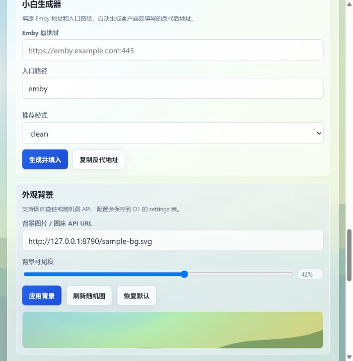
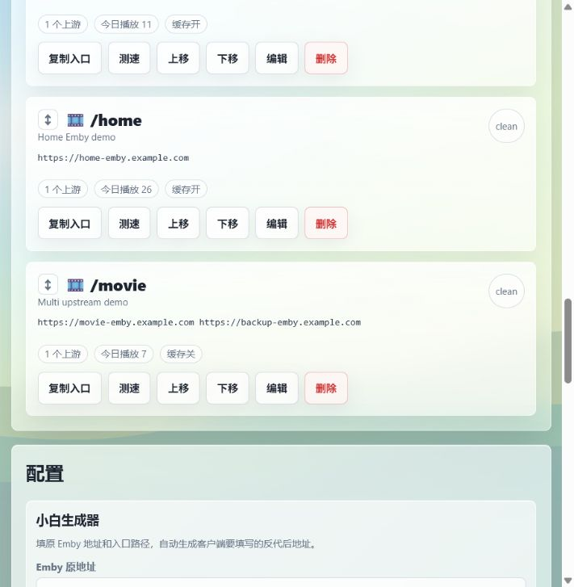

# CF Emby Proxy Panel ✨

Cloudflare Worker 版 Emby 反代面板。

在网页里添加多个 `/路径`，自动保存到 D1，支持优选 IP 写入 Cloudflare DNS，也支持前后端分离 Emby。

[](https://workers.cloudflare.com/)
[](https://developers.cloudflare.com/d1/)
[](https://developers.cloudflare.com/workers/wrangler/)
[](https://deploy.workers.cloudflare.com/?url=https://github.com/nanima1/cf-emby-proxy-panel)

## 📌 目录

- [预览](#️-预览)
- [适合什么场景](#-适合什么场景)
- [功能亮点](#-功能亮点)
- [快速开始](#-快速开始)
- [面板怎么用](#-面板怎么用)
- [DNS 自动化](#-dns-自动化)
- [D1 保存内容](#️-d1-保存内容)
- [常见错误](#-常见错误)

## 🖼️ 预览





## 🎯 适合什么场景

| 场景 | 这个项目怎么帮你 |
| --- | --- |
| 多个 Emby 入口 | 用 `/hk`、`/home`、`/movie` 统一管理 |
| 想隐藏真实上游 | 客户端只看到你的 Worker/自定义域名 |
| 想让新手少填错 | 小白生成器自动整理 Emby 地址和客户端入口 |
| 想做 Cloudflare CDN 加速 | 面板拉取优选 IP，预览后写入 DNS |
| 想换 D1 或迁移配置 | 路由支持 JSON 导入导出 |
| 想定制面板外观 | 图床直链或随机图 API 背景保存到 D1 |

## ✨ 功能亮点

| 模块 | 说明 |
| --- | --- |
| 路由管理 | 每条 `/路径` 独立保存上游、备注、图标、排序和访问策略 |
| 小白生成器 | 填原始 Emby 地址和路径，自动生成反代后地址 |
| 上游容灾 | 多个上游用逗号或换行分隔，异常时自动尝试下一个 |
| 反代模式 | `clean`、`real-ip`、`origin`、`direct`，适配不同 Emby 部署 |
| DNS 自动化 | 拉取/解析优选 IP，预览删除和创建的记录，再写入 Cloudflare |
| 外观背景 | 支持图片直链和随机图 API，配置保存到 D1 `settings` 表 |
| 部署自检 | 检查 D1 绑定、表结构、DNS 变量、Token 权限和默认上游 |
| 导入导出 | JSON 备份/恢复，导入时逐条校验，避免坏配置污染 D1 |

## 🚀 快速开始

新手建议看完整教程：

[小白 Cloudflare 部署教程](./docs/CF_DEPLOY_BEGINNER.md)

会用 Wrangler 的话直接走快速版：

```bash
git clone https://github.com/nanima1/cf-emby-proxy-panel.git
cd cf-emby-proxy-panel
npm install

npx wrangler login
npx wrangler d1 create cf-emby-proxy-panel
```

把 D1 输出的 `[[d1_databases]]` 填进 `wrangler.toml`，确认绑定名是：

```toml
binding = "DB"
```

然后执行：

```bash
npm run d1:init
npx wrangler secret put ADMIN_TOKEN
npm test
npm run dry-run
npm run deploy
```

更短的命令说明看：[快速部署](./docs/QUICK_DEPLOY.md)

## 🎯 面板怎么用

1. 打开部署后的 Worker 地址，输入 `ADMIN_TOKEN`。
2. 先看顶部 `部署自检`，确认 D1 是通过状态。
3. 在 `小白生成器` 填 Emby 原地址，例如 `https://emby.example.com:443`。
4. 填入口路径，例如 `hk`，面板会生成 `https://你的域名/hk`。
5. 点 `一键创建并复制`，然后把复制的地址填进 Emby 客户端。

多个 Emby 就添加多个路径：

```text
https://你的域名/hk
https://你的域名/home
https://你的域名/movie
```

路由卡片里的常用按钮：

| 按钮 | 用途 |
| --- | --- |
| `复制入口` | 复制 Emby 客户端服务器地址 |
| `复制配置` | 复制路径、模式、浏览器策略和全部上游 |
| `测速` | 检查当前上游延迟 |
| `编辑` | 修改路径、上游、模式和备注 |

## ⚡ DNS 自动化

DNS 自动化不是必须项。只想先反代 Emby，可以不配置 `CF_API_TOKEN`、`CF_ZONE_ID`、`CF_DOMAIN`。

如果要用面板写入优选 IP，流程是：

1. 在 Cloudflare 创建只允许当前域名 DNS 编辑的 API Token。
2. 设置 `CF_API_TOKEN`、`CF_ZONE_ID`、`CF_DOMAIN`。
3. 面板里点 `拉取` 或填自定义 IP 源。
4. 勾选要写入的 IP/域名。
5. 先点 `预览 DNS`，确认会删除和创建哪些记录。
6. 确认无误后点 `写入 CF DNS`。

支持写入的内容：

| 输入 | 会创建的记录 |
| --- | --- |
| `8.8.8.8` | `A` |
| `2001:db8::1` 或 `[2001:db8::1]` | `AAAA` |
| `cdn.example.com` | `CNAME` |
| `https://cdn.example.com/path` | 自动取 hostname，写入 `CNAME cdn.example.com` |

安全规则：

- 内网 IP、本机 IP、错误 IP 会被拒绝。
- 带空格的坏域名会被拒绝。
- 重复内容会自动去重。
- 写入时只替换 `CF_DOMAIN` 当前已有的 `A/AAAA/CNAME`，`TXT/MX` 等其他记录会保留。

## 🗄️ D1 保存内容

| 表 | 用途 |
| --- | --- |
| `routes` | 路由、上游、模式、排序和访问策略 |
| `request_stats` | 每日播放请求统计 |
| `settings` | 背景图 URL 和透明度 |

背景设置只保存 `http/https` URL，不保存图片文件，也不允许 `data:` base64。

## 💾 导入导出格式

面板导出的 JSON 可以直接再次导入。单条路由大概长这样：

```json
{
  "prefix": "hk",
  "target": "https://emby-a.example.com\nhttps://emby-b.example.com",
  "mode": "clean",
  "remark": "香港主线",
  "icon": "🎬",
  "cacheImages": true,
  "accessPolicy": {
    "browserMode": "status"
  }
}
```

导入时会自动整理：

- `mode` 大小写写错会整理成支持值，非法值回到 `clean`。
- `browserMode` 支持 `proxy/status/block`，非法值回到 `proxy`。
- `cacheImages` 支持 `true/false`、`1/0`、`开启/关闭`。
- 上游地址会统一成换行分隔。

## ⚙️ 环境变量

| 变量 | 说明 |
| --- | --- |
| `ADMIN_TOKEN` | 面板登录密码，强烈建议设置 |
| `CF_API_TOKEN` | DNS 自动写入需要 |
| `CF_ZONE_ID` | DNS 自动写入需要 |
| `CF_DOMAIN` | 要写入 DNS 的项目域名 |
| `DEFAULT_TARGET` | 可选，默认上游 |
| `BLOCKED_COUNTRIES` | 可选，逗号分隔国家代码 |
| `BLOCKED_CLIENTS` | 可选，逗号分隔客户端关键词 |
| `BROWSER_MODE` | 可选，`proxy`、`status`、`block` |

## 🧪 本地检查

```bash
npm run check
npm test
npm run dry-run
```

- `npm run check`：检查 Worker 语法。
- `npm test`：检查面板脚本、路由表单、防错校验和 Markdown 链接。
- `npm run dry-run`：检查 Cloudflare 打包。

## 📁 项目文件

| 文件 | 说明 |
| --- | --- |
| `src/worker.js` | Worker 主程序，包含面板、API、反代、DNS 自动化 |
| `schema.sql` | D1 初始化 SQL |
| `wrangler.toml` | Cloudflare Worker 配置模板 |
| `tests/panel-tests.mjs` | 本地防回归测试 |
| `docs/QUICK_DEPLOY.md` | 快速部署说明 |
| `docs/CF_DEPLOY_BEGINNER.md` | 小白完整部署教程 |

## 🧯 常见错误

### D1 incomplete input

如果看到：

```text
D1_EXEC_ERROR: Error in line 1: CREATE TABLE IF NOT EXISTS routes (: incomplete input: SQLITE_ERROR
```

说明 SQL 只复制了第一行，没有把整段 `schema.sql` 一起执行。

解决方法看：[D1 incomplete input 怎么办](./docs/CF_DEPLOY_BEGINNER.md#d1-incomplete-input-怎么办)

### 面板能打开但保存失败

优先检查：

- D1 binding 名必须是 `DB`。
- `schema.sql` 必须完整执行。
- 面板顶部 `部署自检` 里 `D1 binding` 和 `D1 tables` 应该通过。

### 导入配置失败

导入 JSON 会逐条校验。看到 `第 1 条路径无效` 这类提示时，优先检查：

- `prefix` 只能用字母、数字、下划线、短横线。
- `target` 必须是 `http://` 或 `https://` 开头的 Emby 上游。
- 多个上游用逗号或换行分隔。

## 🛡️ 安全建议

- 一定设置 `ADMIN_TOKEN`。
- `CF_API_TOKEN` 只给当前域名 DNS 权限。
- 不要提交 `.dev.vars`、Token、密码。
- 已公开发出的 GitHub Token 或 Cloudflare Token，请撤销并重新生成。
